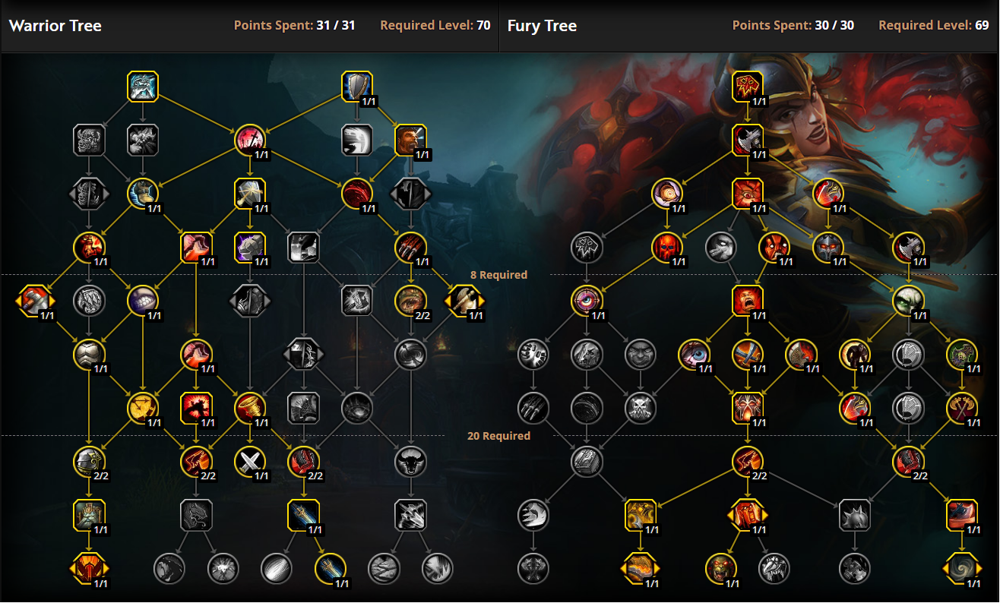
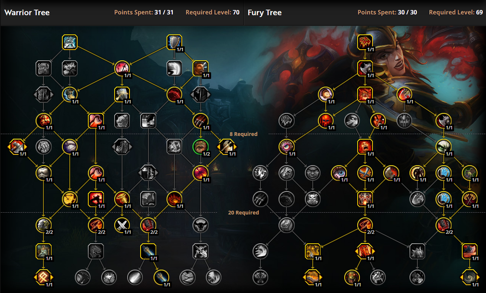

# Fury Warrior Guide (10.5)

**Author:** Athes
										
Welcome, fellow fury warriors! My in-game name is Athes. I have mained fury since end of WoTLK which is when I started my WoW journey in the first place.
This guide is simply here to help you out with any questions or to clear up any misunderstandings with the spec. It is aimed at helping you improve your rotation and hopefully your DPS numbers as well.
Before we even begin with rotation, first we need to talk about stat distribution and finally builds.

## State Priority

Our stat priority is as follows:

- Strength > Mastery > Crit = Haste > Vers

Crit = Haste simply means that both are good for fury, Crit is a bit better for Single Target DPS while Haste improves our AOE dps.

## Builds

I think the best way to show you the build is just to link you the two builds I use for either Single Target or AOE.

### Single Target build

[Single Target Build @ Wowhead](https://www.wowhead.com/talent-calc/warrior/fury/DAQEERUVFEJUFQphEQEBAPVURVUBVEBRKFEUEBV)



### AOE build

[AOE Build @ Wowhead](https://www.wowhead.com/talent-calc/warrior/fury/DAQEERUUFEFUVRphEQEBBPVURFUBVUBFKFEUEBV)



Gonna mention the elephant in the room, or well...there's a couple of them.
First: Our rotation relies on RNG or in laymans terms chance. How so? Regardless of Aoe or Single target builds, our rotation is built on the back of one ability: Raging Blow (or if buffed, Crushing Blows)
If you take a look at the far two right talents in the SPEC tree, you see 2 Raging Blow buffing talents, one of which resets the cd of 1 stack of raging blow (with both builds we have 3).
If you look at the class tree, there's a talent for rampage on the third row first talent on the left that resets the cd for one stack of Raging Blow.
This means that at any point in any fight, regardless of length, you can run out of Raging Blow charges. It is rare, but it does happen. During this drought, you will use your filler ability. But that will be covered in rotation section.

Second: Our tier is kind of lackluster. I would say it's the worst tier set but I don't play the other classes. Simply put, it buffs our Execute. You would think with Juggernaut already
and with Sudden Death, our 4 set would just proc Execute out the booty. While that may be true, Fury was never the "EXECUTE" spec, it was always the spam these 40 abilities spec, with a focus on rampage.
It is also incredibly bad because we *ALREADY* generate a lot of rage just out of sheer class and spec functionality. This means the chances of you over-capping your rage is near 100%. **WHICH IS TERRIBLE**.

Here are a few rules for the spec and if you simply abide by these two rules you will improve already, don't and your numbers will suffer.
First: It is a cardinal sin, no not exaggerating, take it that seriously, to over cap on rage. If you are at or nearing maximum rage, you will dump it into Rampage, it doesn't matter if the stars align and you can get a fat Execute or Raging Blow, **YOU RAMPAGE**.
**DO NOT EVER OVER CAP RAGE.**

Second: You will have 5 Cooldowns now with both builds. Avatar, Recklessness, Ravager, Spear of Bastion, and Odyn's Fury. Keep them **ON COOLDOWN AT ALL TIMES**. **ALWAYS ALWAYS ALWAYS USE THEM.**
The only time you don't use them is if you possibly can't get any value out of them. For example: intermission phase for Eranog. We focus down the add and it dies fast enough regardless,
if we pop everything just to kill the add, then our dps will be dog crap when it matters which would be when Eranog returns.

Last, but certainly not least, always always always always always always always always always always stay enraged. This buffs our damage in two ways: the buff Enrage itself, and our Mastery.
Our mastery increases our dmg done during Enrage by whatever % your mastery is at. That is why Mastery is our highest secondary stat.

Just a warning our rotation can feel at times spammy, which can fluster you and you may use the wrong abilities.
That is fine, nobody is perfect, just do your best to follow the rotation.

## Rotation

### Single Target Rotation

1. Pop Spear of Bastion on your target
2. Throw down Ravager on the target
3. Pop all of your cooldowns (Avatar, Recklessness, Odyn's fury)
4. You *should* have enough rage for a rampage, use Rampage.
5. Raging Blow (or crushing blow) x2-3
6. Should have enough rage for another Rampage, use rampage (it will be buffed this time due to Rushing Blow or Crushing Blow)
7. rinse repeat
8. If you find yourself in a drought, use bloodthirst
9. During all of this, you MUST aim for 100% uptime for Enrage. **ALWAYS ALWAYS ALWAYS BE Enraged**. You do this by either using Rampage or Bloodthirst.
10. Rampage is guaranteed to enrage you, bloodthirst is about a 30% chance? I think, to enrage you.

If you need a more clear visual it'd be:

* Spear > Ravager > All CDS > Rampage > Crushing Blow (Raging Blow buffed by Rampage) > Crushing Blow > Raging Blow (only 2 stacks of buffed Raging Blows) > Rampage > repeat


**Bloodthirst will be used only under 2 conditions**
1. You are low on rage and *NOT* Enraged
2. You are in the aforementioned drought (no raging blow cds)

Note: Raging Blow buffs Rampage up to 5 times, on average I am typically at 3-4 stacks. If you are at rampage value of rage (80) you can try to fit in another Raging Blow or 2. BUT DO NOT OVERCAP

### Aoe Rotation
Exactly the same as Single Target rotation just with whirlwind weaved into the rotation.
Whirlwind once, get 4 stacks of whirlwind, use your single target rotation, whirlwind again, single target rotation, whirlwind again, repeat ad nauseam.
In this rotation your use of bloodthirst really only boils down to whether or not you have a button to press, and 95% of the time you will. I believe, whirlwind is also a better rage generator than bloodthirst.

Before I move on, in my Single Target build, you have an ability called Wrecking Throw. You won't ever be using this in a fight unless a potential target has a shield, in which case you just use it while Enraged and it should melt the shield by itself. (*SHOULD*)
If you have any questions about the rotation, please send me an in game message or mail and I will try to answer them

Defensive cds:
Enraged Regeneration: This is our "OH SHIT" button. Press it if you feel like you are in danger or about to take a lot of dmg. You will take 30% less dmg and bloodthirst will heal for 20% of your health (plus whatever Bloodthirst already heals you for)
If you have it in your build, spell reflect to mitigate spell (magic) dmg. 20% magic dmg reduction.

## Utility

Congratulations, you ran the spec and class that has the least of it. The utility we have in our class tree is a trap, we can't feasibly get them. They are:
the fear we **ALWAYS** had baseline (Intimidating Shout)
Storm Bolt (single target stun)
Piercing Howl (AOE slow, I think 30% slow)
And, the cherry on top, Shockwave at the bottom of the Class tree as a capstone talent. Makes sense? Of course not, but it's blizzard, so give them a break. (It's a frontal cone Stun, was **VERY GOOD**, now dogshit)

## Macros

Few useful Macros (not mandatory, but does help)

### Heroic Leap
```
#showtooltip Heroic Leap
/cast [@cursor] Heroic Leap
```

The above macro automatically casts Heroic Leap wherever your cursor is located if it's a viable Leap location (meaning you can leap there and you don't have environmental collision blocking you)

### Ravager

```
#showtooltip Ravager
/cast [@player] Ravager
```

This will automatically place Ravager at your feet, so make sure you are by your target before using it. I personally don't use this macro because it can backfire quickly (pop it on Broodkeeper Diurna and you won't have it for adds)
A better macro, in my honest opinion, would be to replace @player with @cursor.

### Spear of Bastion

```
#showtooltip Spear of Bastion
/cast {@player] Spear of Bastion
```

Same as the Ravager macro, less capable of backfiring since the area that Spear covers is small anyway. I would still use @cursor instead for precision targetting.


